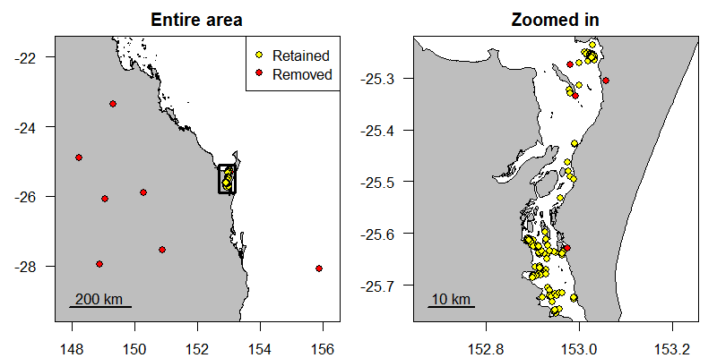

---
output:
  md_document:
    variant: markdown_github
---

<!-- README.md is generated from README.Rmd. Please edit that file -->


SDLfilter
=========

Overview 
--------
SDLfilter contains a variety of functions to screen GPS and/or Argos locations, and to plot them on a map. 


Installation
--------

```{r, eval = FALSE}
# The official version from CRAN:
install.packages("SDLfilter")

# Or the development version from GitHub:
install.packages("devtools")
devtools::install_github("TakahiroShimada/SDLfilter")
```

Usage
--------

There are three main filtering functions.

1. *dupfilter* removes temporal and spatial duplicates.

2. *ddfilter* removes locations with high error.

3. *depthfilter* removes fixes located at a given height from estimated high tide line (e.g. locations on land). 

Please see the help pages and Shimada et al. (2012, 2016) for more details.

```{r SDLfilter, message=FALSE, results='hide', eval = FALSE}
library(SDLfilter)

### Fastloc GPS data obtained from a green turtle
data(turtle)

### Remove temporal and spatial duplicates
turtle.dup <- dupfilter(turtle)

### Remove biologically unrealistic fixes 
turtle.dd <- ddfilter(turtle.dup, vmax=9.9, qi=4, ia=90, maxvlp=2.0)

### Plot the locations on a map
# unfiltered
plotMap(turtle, point.size = 2, line.size = 0.5, axes.lab.size = 0)

# filtered
plotMap(turtle.dd, point.size = 2, line.size = 0.5, axes.lab.size = 0,
        bgmap = "satellite", sb.line.col = "white", sb.text.col = "white")
```





References
--------

If you use the function *ddfilter*, please cite

Shimada T, Jones R, Limpus C, Hamann M (2012) Improving data retention and home range estimates by data-driven screening. Mar Ecol Prog Ser 457:171-180 http://dx.doi.org/10.3354/meps09747

If you use the funtions *dupfilter* or *depthfilter*, please cite

Shimada T, Limpus C, Jones R, Hazel J, Groom R, Hamann M (2016) Sea turtles return home after intentional displacement from coastal foraging areas. Mar Biol 163:1-14 http://dx.doi.org/10.1007/s00227-015-2771-0


Current version
--------
1.1.1 (10 June 2018)


