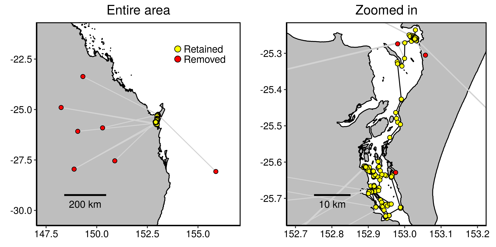
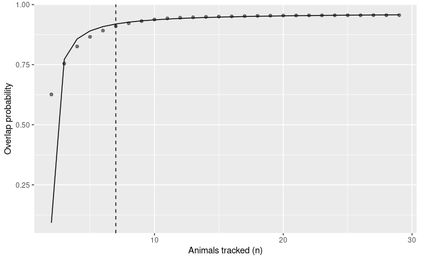

<!-- README.md is generated from README.Rmd. Please edit that file -->

SDLfilter
=========

[](https://zenodo.org/badge/latestdoi/27752990)
[](https://cran.r-project.org/package=SDLfilter)

Overview
--------

SDLfilter contains a variety of functions to screen GPS/Argos locations
and to assess the sample size of tracking data for the analysis of
animal distributions.

Installation
------------

``` r
# The official version from CRAN:
install.packages("SDLfilter")

# Or the development version from GitHub:
install.packages("devtools")
devtools::install_github("TakahiroShimada/SDLfilter")
```

Usage
-----

``` r
library(SDLfilter)
```

### Location filtering

There are three main filtering functions.

1.  *dupfilter* filters temporal and spatial duplicates.

2.  *ddfilter* filters locations with high error.

3.  *depthfilter* filters locations by water depth.

``` r
## Fastloc GPS data obtained from a green turtle
data(turtle)

## Remove temporal and spatial duplicates
turtle.dup <- dupfilter(turtle)

## Remove biologically unrealistic fixes 
turtle.dd <- ddfilter(turtle.dup, vmax=9.9, qi=4, ia=90, vmaxlp=2.0)
```



### Assessing sample sizes

#### Probability-based approach

``` r
## 1. Utilisation uistributions of flatback turtles.
data(curtis)
```

The input data can be either a matrix or a list of RasterLayer objects.
Each row of the matrix or each RasterLayer object contains the
probability distribution of an animal. The function assumes that each
column of a matrix is associated with a unique geographical location,
therefore it is critical that the grid size and geographical extent are
the consistent across UDs. In this example, the grid size was 1km and
the geographical extent was 1901789, 1972789, -2750915, -2653915
(EPSG:3577) across all 29 layers.

``` r
## 2. Calculate overlap probability from 1000 random permutation.
overlap <- boot_overlap(curtis, R = 1000, method = "PHR")
```

It will take some time to run this code depending on the number of
iterations and the machine specs. The runtime was about 2.5 minutes for
1000 iterations on a linux machine (Intel i7-8650U CPU @ 1.90GHz, 32GB
RAM).

``` r
## 3. Find the minimum sample size required to estimate the general distribution.
a <- asymptote(overlap)
```

As described in the main text, an asymptote was considered once the mean
overlap probability exceeded 95% of the estimated horizontal asymptote.
The sample size linked to this value was deemed to be the minimum sample
size required to represent the general distribution of the group.

``` r
## 4. Plot the mean probability and rational function fit relative to the sample sizes.
```



> Please see the package help pages and Shimada et al. (2012, 2016) for
> more details.

References
----------

If you use the function *ddfilter*, please cite

Shimada T, Jones R, Limpus C, Hamann M (2012) Improving data retention
and home range estimates by data-driven screening. *Mar Ecol Prog Ser*
457:171-180 doi:
[10.3354/meps09747](http://dx.doi.org/10.3354/meps09747)

If you use the functions *dupfilter* or *depthfilter*, please cite

Shimada T, Limpus C, Jones R, Hazel J, Groom R, Hamann M (2016) Sea
turtles return home after intentional displacement from coastal foraging
areas. *Mar Biol* 163:1-14 doi:
[10.1007/s00227-015-2771-0](http://dx.doi.org/10.1007/s00227-015-2771-0)

Shimada T,…. (under review) Assessing the sample size of tracking tag
deployments for animal distribution analysis.

Current version
---------------

2.0.0.9004 (21 June 2020)
