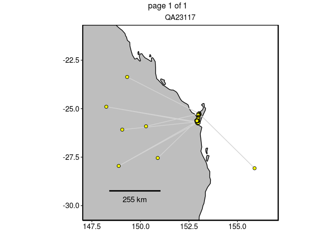
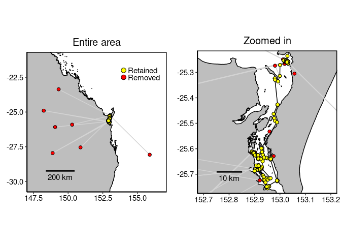

<!-- README.md is generated from README.Rmd. Please edit that file -->
SDLfilter
=========

Overview
--------

SDLfilter contains a variety of functions to screen GPS and/or Argos locations and to assess sample sizes of tracking data for the analysis of animal distributions.

Installation
------------

``` r
# The official version from CRAN:
install.packages("SDLfilter")

# Or the development version from GitHub:
install.packages("devtools")
devtools::install_github("TakahiroShimada/SDLfilter")
```

Usage
-----

``` r
library(SDLfilter)
```

    ## Loading required package: ggplot2

**Location filtering**

There are three main filtering functions.

1.  *dupfilter* removes temporal and spatial duplicates.

2.  *ddfilter* removes locations with high error.

3.  *depthfilter* removes fixes located at a given height from estimated high tide line (e.g. locations on land).

Please see the help pages and Shimada et al. (2012, 2016) for more details.

``` r
### Fastloc GPS data obtained from a green turtle
data(turtle)

### Remove temporal and spatial duplicates
turtle.dup <- dupfilter(turtle)
```

    ## 
    ## dupfilter_exact removed 0 of 429 locations.
    ## dupfilter_qi removed 1 of 429 locations.
    ## dupfilter_time removed 2 of 428 locations.
    ## dupfilter_space removed 0 of 426 locations.
    ## 
    ## Input data: 429 locations.
    ## Filtered data: 426 locations.
    ## dupfilter removed 3 locations (0.7% of original data).

``` r
### Remove biologically unrealistic fixes 
turtle.dd <- ddfilter(turtle.dup, vmax=9.9, qi=4, ia=90, vmaxlp=2.0)
```

    ## 
    ## ddfilter_speed removed 5 of 426 locations.
    ## ddfilter_loop removed 2 of 421 locations.
    ## 
    ## Input data: 426 locations.
    ## Filtered data: 419 locations.
    ## ddfilter removed 7 locations (1.64% of original data).

``` r
### Plot the locations on a map
p1<-plotMap(turtle.dup, bgmap=Australia, point.size = 2, line.size = 0.5, axes.lab.size = 0, 
             sb.distance=200, multiplot = FALSE, point.bg = "red",
             title.size=15, title="Entire area")[[1]] + 
   geom_point(aes(x=lon, y=lat), data=turtle.dd, size=2, fill="yellow", shape=21)+
   geom_point(aes(x=x, y=y), data=data.frame(x=c(154, 154), y=c(-22, -22.5)), 
              size=3, fill=c("yellow", "red"), shape=21) + 
   annotate("text", x=c(154.3, 154.3), y=c(-22, -22.5), label=c("Retained", "Removed"), 
            colour="black", size=4, hjust = 0)

 ## Zoomed in
 p2<-plotMap(turtle.dup, bgmap=SandyStrait, xlim=c(152.7, 153.2), ylim=(c(-25.75, -25.24)), 
             axes.lab.size = 0, sb.distance=10, point.size = 2, point.bg = "red", line.size = 0.5, 
             multiplot = FALSE, title.size=15, title="Zoomed in")[[1]] + 
 geom_path(aes(x=lon, y=lat), data=turtle.dd, size=0.5, colour="black", linetype=1) + 
 geom_point(aes(x=lon, y=lat), data=turtle.dd, size=2, colour="black", shape=21, fill="yellow")

 gridExtra::marrangeGrob(list(p1, p2), nrow=1, ncol=2)
```



**Assessing sample sizes** \#\# Probability-based approach \#\#\#\# 1. Utilisation Distributions (UD) of 29 flatback turtles that nested in Curtis Island, Australia (reduced resolution - 1km grids).

``` r
data(curtis)
```

The input data can be either a matrix or a list of RasterLayer objects. Each row of the matrix or each RasterLayer object contains the probability distribution of an animal. The function assumes that each column of a matrix is associated with a unique geographical location, therefore it is critical that the grid size and geographical extent are the consistent across UDs. For the the UDs used in this example, the grid size was 50m and the geographical extent was fixed as 1902264, 1973064, -2750440, -2653540 (EPSG:3577).

<br/>

#### 2. Calculate overlap probability from 1000 random permutation

``` r
overlap <- boot_overlap(curtis, R = 1000, method = "PHR")
```

    ## 
      |                                                        
      |                                                  |   0%
      |                                                        
      |                                                  |   1%
      |                                                        
      |=                                                 |   1%
      |                                                        
      |=                                                 |   2%
      |                                                        
      |=                                                 |   3%
      |                                                        
      |==                                                |   3%
      |                                                        
      |==                                                |   4%
      |                                                        
      |==                                                |   5%
      |                                                        
      |===                                               |   5%
      |                                                        
      |===                                               |   6%
      |                                                        
      |===                                               |   7%
      |                                                        
      |====                                              |   7%
      |                                                        
      |====                                              |   8%
      |                                                        
      |====                                              |   9%
      |                                                        
      |=====                                             |   9%
      |                                                        
      |=====                                             |  10%
      |                                                        
      |=====                                             |  11%
      |                                                        
      |======                                            |  11%
      |                                                        
      |======                                            |  12%
      |                                                        
      |======                                            |  13%
      |                                                        
      |=======                                           |  13%
      |                                                        
      |=======                                           |  14%
      |                                                        
      |=======                                           |  15%
      |                                                        
      |========                                          |  15%
      |                                                        
      |========                                          |  16%
      |                                                        
      |========                                          |  17%
      |                                                        
      |=========                                         |  17%
      |                                                        
      |=========                                         |  18%
      |                                                        
      |=========                                         |  19%
      |                                                        
      |==========                                        |  19%
      |                                                        
      |==========                                        |  20%
      |                                                        
      |==========                                        |  21%
      |                                                        
      |===========                                       |  21%
      |                                                        
      |===========                                       |  22%
      |                                                        
      |===========                                       |  23%
      |                                                        
      |============                                      |  23%
      |                                                        
      |============                                      |  24%
      |                                                        
      |============                                      |  25%
      |                                                        
      |=============                                     |  25%
      |                                                        
      |=============                                     |  26%
      |                                                        
      |=============                                     |  27%
      |                                                        
      |==============                                    |  27%
      |                                                        
      |==============                                    |  28%
      |                                                        
      |==============                                    |  29%
      |                                                        
      |===============                                   |  29%
      |                                                        
      |===============                                   |  30%
      |                                                        
      |===============                                   |  31%
      |                                                        
      |================                                  |  31%
      |                                                        
      |================                                  |  32%
      |                                                        
      |================                                  |  33%
      |                                                        
      |=================                                 |  33%
      |                                                        
      |=================                                 |  34%
      |                                                        
      |=================                                 |  35%
      |                                                        
      |==================                                |  35%
      |                                                        
      |==================                                |  36%
      |                                                        
      |==================                                |  37%
      |                                                        
      |===================                               |  37%
      |                                                        
      |===================                               |  38%
      |                                                        
      |===================                               |  39%
      |                                                        
      |====================                              |  39%
      |                                                        
      |====================                              |  40%
      |                                                        
      |====================                              |  41%
      |                                                        
      |=====================                             |  41%
      |                                                        
      |=====================                             |  42%
      |                                                        
      |=====================                             |  43%
      |                                                        
      |======================                            |  43%
      |                                                        
      |======================                            |  44%
      |                                                        
      |======================                            |  45%
      |                                                        
      |=======================                           |  45%
      |                                                        
      |=======================                           |  46%
      |                                                        
      |=======================                           |  47%
      |                                                        
      |========================                          |  47%
      |                                                        
      |========================                          |  48%
      |                                                        
      |========================                          |  49%
      |                                                        
      |=========================                         |  49%
      |                                                        
      |=========================                         |  50%
      |                                                        
      |=========================                         |  51%
      |                                                        
      |==========================                        |  51%
      |                                                        
      |==========================                        |  52%
      |                                                        
      |==========================                        |  53%
      |                                                        
      |===========================                       |  53%
      |                                                        
      |===========================                       |  54%
      |                                                        
      |===========================                       |  55%
      |                                                        
      |============================                      |  55%
      |                                                        
      |============================                      |  56%
      |                                                        
      |============================                      |  57%
      |                                                        
      |=============================                     |  57%
      |                                                        
      |=============================                     |  58%
      |                                                        
      |=============================                     |  59%
      |                                                        
      |==============================                    |  59%
      |                                                        
      |==============================                    |  60%
      |                                                        
      |==============================                    |  61%
      |                                                        
      |===============================                   |  61%
      |                                                        
      |===============================                   |  62%
      |                                                        
      |===============================                   |  63%
      |                                                        
      |================================                  |  63%
      |                                                        
      |================================                  |  64%
      |                                                        
      |================================                  |  65%
      |                                                        
      |=================================                 |  65%
      |                                                        
      |=================================                 |  66%
      |                                                        
      |=================================                 |  67%
      |                                                        
      |==================================                |  67%
      |                                                        
      |==================================                |  68%
      |                                                        
      |==================================                |  69%
      |                                                        
      |===================================               |  69%
      |                                                        
      |===================================               |  70%
      |                                                        
      |===================================               |  71%
      |                                                        
      |====================================              |  71%
      |                                                        
      |====================================              |  72%
      |                                                        
      |====================================              |  73%
      |                                                        
      |=====================================             |  73%
      |                                                        
      |=====================================             |  74%
      |                                                        
      |=====================================             |  75%
      |                                                        
      |======================================            |  75%
      |                                                        
      |======================================            |  76%
      |                                                        
      |======================================            |  77%
      |                                                        
      |=======================================           |  77%
      |                                                        
      |=======================================           |  78%
      |                                                        
      |=======================================           |  79%
      |                                                        
      |========================================          |  79%
      |                                                        
      |========================================          |  80%
      |                                                        
      |========================================          |  81%
      |                                                        
      |=========================================         |  81%
      |                                                        
      |=========================================         |  82%
      |                                                        
      |=========================================         |  83%
      |                                                        
      |==========================================        |  83%
      |                                                        
      |==========================================        |  84%
      |                                                        
      |==========================================        |  85%
      |                                                        
      |===========================================       |  85%
      |                                                        
      |===========================================       |  86%
      |                                                        
      |===========================================       |  87%
      |                                                        
      |============================================      |  87%
      |                                                        
      |============================================      |  88%
      |                                                        
      |============================================      |  89%
      |                                                        
      |=============================================     |  89%
      |                                                        
      |=============================================     |  90%
      |                                                        
      |=============================================     |  91%
      |                                                        
      |==============================================    |  91%
      |                                                        
      |==============================================    |  92%
      |                                                        
      |==============================================    |  93%
      |                                                        
      |===============================================   |  93%
      |                                                        
      |===============================================   |  94%
      |                                                        
      |===============================================   |  95%
      |                                                        
      |================================================  |  95%
      |                                                        
      |================================================  |  96%
      |                                                        
      |================================================  |  97%
      |                                                        
      |================================================= |  97%
      |                                                        
      |================================================= |  98%
      |                                                        
      |================================================= |  99%
      |                                                        
      |==================================================|  99%
      |                                                        
      |==================================================| 100%

    ## Runtime: 2 minutes 30 seconds

It may take some time to run this code depending on the number of iterations and the machine specs. The runtime was about 2 minutes on a linux machine (Intel i7-8650U CPU @ 1.90GHz, 32GB RAM) for 1000 iterations.

<br/>

#### 3. Find the minimum sample size required to estimate the general distribution.

``` r
a <- asymptote(overlap)
```

    ## 
    ## Asymptote reached at x = 7
    ## Estimated Horizontal asymptote ~ 0.9715679

As described in the main text, we considered that an asymptote had been attained once the mean index value exceeded 95% of the estimated horizontal asymptote. The sample size linked to this value was deemed to be the minimum sample size required to represent the general distribution of the group.

<br/>

#### 4. Plot the mean probability relative to the sample size and rational function fit.

``` r
ggplot(data = overlap$summary)+
  geom_point(aes(x = N, y = mu), alpha = 0.5) + 
  geom_path(data = a$results, aes(x = x, y = ys)) + 
  geom_vline(xintercept = a$min.n, linetype = 2) +
  labs(x = "N", y = "Overlap probability")
```



References
----------

If you use the function *ddfilter*, please cite

Shimada T, Jones R, Limpus C, Hamann M (2012) Improving data retention and home range estimates by data-driven screening. Mar Ecol Prog Ser 457:171-180 <http://dx.doi.org/10.3354/meps09747>

If you use the functions *dupfilter* or *depthfilter*, please cite

Shimada T, Limpus C, Jones R, Hazel J, Groom R, Hamann M (2016) Sea turtles return home after intentional displacement from coastal foraging areas. Mar Biol 163:1-14 <http://dx.doi.org/10.1007/s00227-015-2771-0>

If you use the functions to assess sample sizes (e.g. *boot\_overlap*), please cite

Shimada T,.... (in prep) Assessing sample sizes for the analysis of animal distributions using the R package SDLfilter.

Current version
---------------

1.4.0 (22 January 2020)
